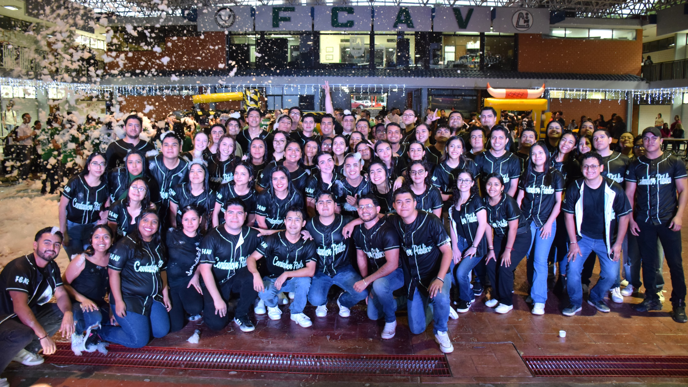

# Propuesta Página Web para la FCAV



## Objetivo

Desarrollar un sitio con características de mejora que permitan a los futuros aspirantes a tener una mejor  
experiencia al momento de buscar información sobre las carreras, eventos, servicios, entre otros.

### Comunidad estudiantil

Fomentar la participación de la comunidad para el desarrollo de la página, permitiendo a los estudiantes  
practicar sus habilidades de Lic. TI y aportar ideas de mejora para un mismo fin.

## Tecnologías

Por el momento el proyecto se desarrollará con los lenguajes base para el desarrollo web:

- HTML
- CSS

## Estrucutura del proyecto

```
src/
├── assets/ (Archivos estaticos)
│   ├── banner.jpg
│   ├── logo.png
│   └── ...
├── pages/ (Subcarpetas con las páginas del sitio)
│
├── styles/ (Archivos de estilos modulares)
│   ├── main.css
│   └── utilities.css
│   └── variables.css
│   └── components/
│   └── pages/
│
├── index.html (Página principal)
```

## Metodologías usadas

### Css

Se utilizará la metodología BEM (Block, Element, Modifier) para la organización de los estilos.  
Más información en ➡️ [BEM](http://getbem.com/)

```css
.block {} (Componente)
.block__element {} (Elemento)
.block--modifier {} (Modificador)
```
